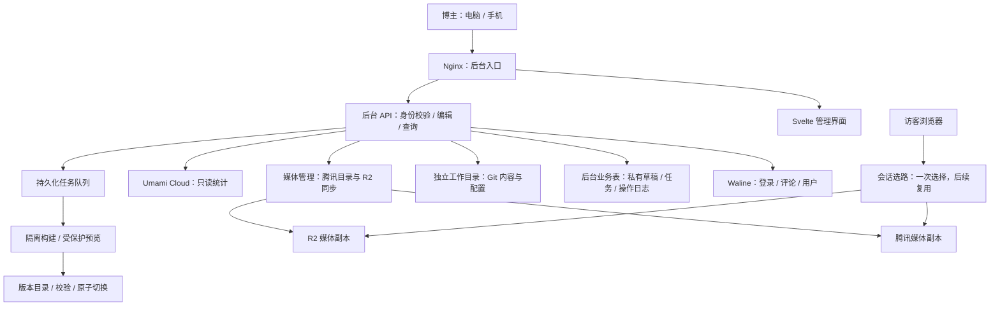

# DcElysion 统一管理后台设计

状态：第一、二阶段、第三阶段发布执行接口、第四阶段统一媒体、第五阶段配置管理与第六阶段评论/用户管理已在本地实现，尚未部署。发布与媒体使用隔离 fixture/mock；第五阶段公开适配使用可信源码及非敏感 fixture 构建。本机缺少容器，不可信 MDX 的真实隔离构建仍未验证，真实 R2/腾讯未联调。第七、八阶段仍为设计。2026-10-01更新；历史部署记录不代表本次重新验证线上状态。

## 已确认目标

- 一个只有博主本人可以登录的在线后台，适配电脑和手机。
- 管理文章、动态、评论、用户、BGM、相册，以及网站改动与 Git 提交记录。
- 增加浏览量等数据可视化。
- 面向腾讯云 + Waline 的最终架构建设，先私有预览，备案后开放。
- 不新增博客会员体系；用户管理复用现有评论账号，后台操作权限仅授予指定博主。
- 媒体采用腾讯服务器与 R2 双份存储、双来源分发；每个标签页会话只选路一次，后续媒体沿用结果，具体规则见“媒体双来源分发与会话选路”。

## 当前基础与约束

| 能力 | 当前实现与依据 | 后台接入影响 |
| --- | --- | --- |
| 文章、动态 | `src/content.config.ts`，`src/content/posts/`、`src/content/dynamic/` | 保留 Markdown/MDX、frontmatter、现有 URL 与渲染管线 |
| 评论 | `src/config/commentConfig.ts` | 公网默认 Twikoo，腾讯构建用环境变量切换 Waline；不能混用两套数据 |
| 账号 | `deploy/tencent/README.md`、`waline-overlay/` | 私有 Waline 已有邮箱/昵称登录、二步验证兼容、密码重置和会话失效逻辑 |
| 媒体 | `src/config/musicConfig.ts`、`galleryConfig.ts`，`src/utils/gallery-utils.ts` | 当前配置使用 R2 URL；腾讯部署记录已有同路径媒体副本，计划增加双来源分发和会话选路，尚未实现 |
| 相册 | 构建时扫描 `public/gallery/<id>/`，结合 `gallery-previews.json` | 上传远程文件不会自动加入相册，需要显式图片清单和预览处理 |
| 统计 | `src/config/analyticsConfig.ts`、`src/components/analytics/` | 已配置 Umami Cloud、GA、Clarity、51la，尚未验证后台 API 访问与历史数据可用性 |
| GitHub 发布 | `.github/workflows/deploy.yml` | 推送 master 会触发 Pages 部署，不能等同于腾讯发布 |
| 腾讯发布 | `deploy/tencent/install-staging.sh` 与 README | 校验发布包、保留 release、切换 current；当前为私有预览 |

这些现有资产可以复用；目前已实现独立后台登录、文章/动态列表、私有内容编辑、本地发布接口与统一媒体上传/同步，评论管理尚未接入，真实隔离构建、对象存储与外部发布联调尚未完成。

## 功能与界面

后台导航为：概览、文章、动态、评论、用户、音乐、相册、数据分析、改动与发布、账号设置。

参考 Fireflux 后，补充回收站入口，以及由字段 schema 驱动的站点设置表单。站点设置先覆盖明确支持的字段；无法可靠解析的表达式只读显示，不承诺所有配置都可编辑。

| 模块 | 功能 | 验收结果 |
| --- | --- | --- |
| 概览 | 待处理评论、草稿数量、近期流量、最近发布及异常状态 | 所有卡片可进入对应列表；未接入数据显示明确空态 |
| 文章 | 搜索筛选、Markdown/MDX 编辑、元数据表单、图片插入、自动保存、预览、发布、撤回、历史版本 | 正文、标点、未知 frontmatter 字段不丢失；草稿不会进入公开构建或搜索 |
| 动态 | 正文与图片编辑、图片排序、位置、置顶、草稿、发布和撤回 | 保留图片顺序及已有评论路径；不改写历史动态标识 |
| 评论 | 分页搜索、按文章/状态筛选、审核、编辑、回复、标记垃圾和删除 | 操作通过当前 Waline 服务，沿用通知行为和权限校验 |
| 用户 | 评论用户查询、状态管理、关联评论；本人资料、安全设置和会话管理 | 普通评论用户无法进入管理后台；不开放后台注册和多人角色配置 |
| BGM | 音频、封面、歌词上传；曲名/作者、排序、试听、移出歌单 | 使用已有播放器，保留未修改字段；被历史版本引用的资源不立即删除 |
| 相册 | 新建/编辑相册、上传图片、排序、封面、日期/地点/标签、预览与移除 | 清单顺序决定展示；缩略图与原图对应；Fancybox 仍打开原图 |
| 数据分析 | PV、UV、访问趋势、热门内容、来源、设备与地区分布 | 明确数据源、时间范围、口径、刷新时间与缺失状态 |
| 改动与发布 | 待发布改动、文件差异、提交记录、发布队列、构建日志、版本及回退 | 区分保存、提交、推送、部署；失败可定位到具体阶段 |

电脑端使用侧栏、列表和编辑预览双栏；手机端使用抽屉导航、单栏编辑及编辑/预览切换。长列表分页，上传显示进度与失败原因，离开未保存内容时提醒。图表提供文字摘要或表格，不能仅靠颜色区分数据。

## 建议架构

独立后台应用与 API 部署在现有腾讯服务器，通过 Nginx 同源反代。前端沿用 Svelte + TypeScript；服务端采用独立 Node.js 服务；后台业务表放入独立 PostgreSQL schema 和受限数据库角色。

后台使用独立页面外壳，避免加载公开博客的 Swup、BGM、看板娘和访问统计。前台文章样式和现有公开访问路径保持兼容。

### 身份与权限

- 登录通过现有 Waline 校验邮箱/昵称、密码和二步验证；新后台仅接受显式配置的不可变用户 ID，并要求当前账号仍具备管理员状态。
- 后台发行自己的短期、可撤销服务端会话，浏览器仅持有 HttpOnly、Secure、SameSite cookie；不在浏览器保存 Waline 管理令牌或外部服务密钥。
- 身份桥接必须沿用当前会话版本失效机制：改密、封禁、撤销会话后不能继续使用后台。不能只在初次登录时检查角色。
- 服务端每个 API 均做授权；写入请求校验 Origin/CSRF，登录有限流。后台资源和草稿预览均受保护，禁止被搜索引擎和公共缓存收录。
- Git、统计及存储凭据只在服务端配置。后台进程不持有任意 root shell 能力；发布通过固定参数、限定目录和受限执行器完成。

### 内容数据

- 发布内容继续由 Git 中的 Markdown/MDX 和配置清单定义，沿用现有 Astro 构建、RSS、Pagefind 和内容 schema。
- 自动保存存入后台私有草稿区，不直接推送仓库。公开仓库中的 `draft: true` 仅控制网站显示，不能保密源码，所以未发布正文不能靠这个字段保护。
- 已发布内容编辑保存为私有修订，发布前记录基准 commit/blob；发现仓库已被本地编辑、其他客户端或上游更新时展示冲突，不静默覆盖。
- 表单只更新明确管理的 frontmatter 字段；保留未知字段、正文格式和图片顺序。MDX 保留源码编辑模式，不承诺无损富文本转换。
- 预览复用真实 Astro 管线，并在隔离构建任务中处理 MDX；不在拥有数据库、Git 写权限或部署密钥的 API 进程执行用户内容。
- 预览链接受身份保护。恢复历史文章生成新修订和新提交，保留审计链。

### 音乐与相册

- 将经常编辑的歌单和相册元数据提取为可验证的结构化清单，现有 TypeScript 配置通过适配层读取；同步所有消费者与类型，不用字符串替换修改 TypeScript 源码。
- 相册需新增明确图片清单，包含原图键、预览键、尺寸、顺序和内容哈希。兼容当前目录扫描及 `urls.txt`，迁移验证后再决定是否停用扫描。
- 上传先写暂存区，校验实际文件类型、尺寸/大小及哈希；生成预览并验证可访问后，才写入可发布清单。
- 媒体用不可变对象键，替换资源创建新键；后台统一写入并同步腾讯目录与 R2，记录两边状态。只有内容一致且已验证可访问的副本才能作为同一资源的分发来源，避免两边独立编辑产生版本冲突。
- 先完成媒体交付再部署引用页面。移除清单引用与物理删除分离，跨历史版本检查引用后才能清理。
- 相册现有密码是页面展示保护；若将来要求私密文件，需要另做存储鉴权，不能把当前公开对象当成私有资源。

### 媒体双来源分发与会话选路

状态：第八阶段已完成本地实现，公开策略默认关闭；已新增前台/私有策略及受控媒体服务配置，未修改生产服务、DNS或执行部署。规则如下，实际能力及验证边界见admin/README.md第八阶段与deploy/tencent/media-routing.md。

适用范围为本站在腾讯服务器与 R2 上均有已校验副本的公开媒体，包括图片、相册原图与预览图、音乐和视频。页面 HTML、后台 API、评论服务、第三方外链，以及没有双份副本的资源不参与选路；单来源资源继续使用其有效地址。

#### 已确认的访问行为

1. **首次进入博客时选路一次，比较腾讯与 R2；测速不能阻塞页面显示，结果出来前使用默认来源。** 探测有明确超时和流量预算；探测失败或无法得出可靠结果时沿用可用默认来源，不在每个资源请求时重新测速。
2. **选路完成后，新加载的图片、相册、音乐和视频都使用该来源，不再逐个判断。已经开始加载或播放的资源保持原地址。** 同一次会话采用一个首选来源；换歌曲、循环视频、暂停恢复或拖动进度不触发选路，也不替换当前媒体来源。
3. **结果保存在当前标签页会话中，站内跳转、Swup 换页和刷新都复用；新会话或手动“重新选路”时才重新检测。** 不因页面切换、定时到期、网络变化或服务器负载变化自动重新测速。拟使用 `sessionStorage` 保存首选来源和选路状态；存储不可用时至少在当前文档及 Swup 生命周期内复用内存状态，整页刷新后的复用能力需明确降级。
4. **个别资源失败时允许备用地址重试一次，只处理失败资源，不触发整站重新测速。已经播放的音视频仍按此前约定，不自动中途换源。** 备用重试不改变会话首选来源；两个来源均失败后显示失败或重试入口，不来回切换。音视频只在尚未开始播放时允许自动备用重试，播放开始后发生故障由用户决定重试。

“手动重新选路”只影响之后尚未发起的媒体加载，已经显示、下载或播放的资源保持现状。JavaScript 不可用时，页面仍可通过原始默认 URL 加载媒体。

#### 双副本与服务端约束

- 用统一资源 ID/对象键映射两个来源，保留内容哈希和版本。正文与歌单不维护两套独立内容，前端根据映射解析所选来源；图片的 `srcset`、相册预览和 Fancybox 原图地址也须遵守同一规则。
- 上传与同步通过持久化后台任务执行，失败可重试。只有媒体清单标记为双副本就绪的资源才参与双来源选路，未同步完成时不得生成指向缺失副本的 URL。
- 两边校验文件内容、长度、MIME、缓存策略及所需跨域响应；音视频验证 Range/206 和实际播放。仅替换域名不能视为完成接入。
- 用户提供的服务器规格为 2 核、2 GB 内存、50 GB SSD、5 Mbps 公网带宽、400 GB/月流量。首次选路需要结合服务器是否允许承接新流量；5 Mbps 总出口保护仍由服务端执行，客户端测速不能代替全局限流。
- 服务端容量保护不得通过反复修改客户端会话来源实现。已有腾讯会话可能在后续负载增加时变慢；若新资源请求被明确拒绝或加载失败，按单资源备用重试规则处理，已播放媒体不自动迁移。同步上传到 R2 也需纳入服务器出口预算。
- 腾讯媒体公网入口仍按既有计划在备案、HTTPS 和迁移验证完成后启用；此前只能在可访问两边的私有验证环境中测试。

#### 实施时细化的参数

默认来源建议先沿用现有 R2，探测对象大小、超时、优胜判定、服务器接流量阈值及带宽预算在实际测速后确定；这些参数尚未完成实测，不承诺固定提速比例。两边同一版本副本的可用性是启用前提。

#### 验收条件

- 首次访问只启动一轮选路，探测进行中首屏正常显示；探测超时仍能加载默认来源。
- 同标签页刷新、前进/后退、Swup 往返和后续歌曲/视频加载均不重复测速；Swup 重入无重复监听器或重复探测任务。
- 选路完成前已开始加载的资源和已播放音视频不会被换源；完成后新请求正确复用会话首选来源。
- 单资源失败最多自动切换来源一次，既不重测也不改变会话首选；两边失败时无重试循环，播放中故障不自动换源。
- 手动重新选路只影响后续加载；测试新会话、会话存储不可用和无 JavaScript 的降级行为。
- 在隔离测试环境验证腾讯拒绝新流量、R2 不可达、缺少副本和副本不一致；核对图片、响应式图片、相册预览/原图及音视频地址。
- 私有实测两边请求耗时、失败率和服务器出口占用，不能将本地模拟成功当作公网选路性能已验证。

### 提交、发布与操作记录

后台明确提供保存草稿、预览、发布三种动作；Git 提交/推送作为发布任务中可见的独立阶段。默认目标为腾讯私有预览，正式环境在完成切换条件后单独启用。

一次发布固化修订快照与基准版本，验证并形成候选提交，在隔离环境构建、验证媒体与产物，然后按目标进行 Git 同步和版本安装。任务必须记录每一步结果；构建成功不代表推送成功，推送成功不代表腾讯部署成功。

- 独立任务工作目录，绝不自动暂存博主电脑上的所有文件或无关服务器改动。
- 只允许白名单内容/配置路径；Git 操作用参数数组调用，校验路径穿越与符号链接逃逸。
- 推送主分支之前复核基准，冲突不 force push；显式标示现有 master 推送会触发 GitHub Pages 的副作用，迁移时再决定如何调整旧工作流。
- 发布执行器复用现有包摘要检查、release 保留、并发锁与原子切换逻辑。任务状态持久化，刷新或重启不丢失任务；重复点击不会重复发布。
- 回退前展示目标版本及当前版本，回退不会重写 Git 历史。单篇内容恢复与整站 release 回退是两个动作。
- 网站改动页区分 Git 提交日志、后台操作日志和部署日志；GitHub 已提交改动可以读取，离线电脑未同步的改动不能被线上后台看到。
- 日志记录时间、操作者、目标、动作、任务 ID、commit、release 和结果，不记录密码、令牌或完整敏感请求。

## 数据可视化

用户于2026-10-04选择自建 Umami：3.4.0/PostgreSQL已部署并接通现有腾讯私有后台统计API，详情见[自建接入记录](2026-10-04-umami-selfhost.md)。服务端读取统计API并短期缓存，前端取得经过授权的报表数据。Cloud历史保留，不迁移、不合并；正式主站尚待统一上线切换采集。尚未配置时显示“未配置/暂无数据”，禁止展示伪造数字或将请求失败填为0。

| 视图 | 指标与图表 | 口径要求 |
| --- | --- | --- |
| 概览卡片 | PV、UV、访问次数；近期评论与内容数量 | 每张卡标明数据来源；内容与评论数量来自各自服务 |
| 流量趋势 | 按小时/天的 PV、UV 折线图 | 默认 Asia/Shanghai；今日、7 天、30 天及自定义范围 |
| 内容表现 | 热门文章、页面浏览趋势、来源 | 按规范 URL 映射文章标题；路径改名记录单独处理 |
| 来源分布 | 引荐网站、直接访问、可用的 UTM | 不把缺失来源猜测为搜索引擎 |
| 访客分布 | 设备、浏览器、国家/地区 | 以统计平台可返回的聚合维度为准；不展示访客身份画像 |
| 期间对比 | 与前一等长时间段的变化 | 前期为 0 时显示新增或无可比数据；UV 不累计每日值充当期间 UV |

PV 是所选来源记录的页面浏览事件，UV 是该平台按当前范围和识别机制去重的访客估计，不等于实际人数。评论系统的阅读计数另行标注；GA、51la、Umami 的数字不合并。性能指标尚未启用，不能把当前配置的 `collectWebVitals: false` 描述为已有性能数据。BGM 播放、图片打开等事件如需展示，应另行补充事件采集，历史不会自动补齐。

验证 Swup 首次访问、站内跳转、返回和前进时每次导航的计数行为，避免追踪脚本自身监听 History API 后又手动重复发送；后台、私有预览和验收浏览器应排除在正式统计之外。

Umami 官方说明：Cloud 访问需要 [API key](https://docs.umami.is/docs/cloud/api-key)，可通过 [统计 API 构建自定义报表](https://docs.umami.is/docs/guides/automate-reporting-with-api)。[SPA 追踪说明](https://docs.umami.is/docs/guides/track-single-page-apps) 表明追踪器可感知客户端导航，但本博客具体行为仍需实测。

## 实施顺序与验收门槛

1. **后台基础与登录（本地已实现）**：独立应用/API、数据库基础、Waline 身份桥接、唯一管理员、可撤销会话、桌面/手机导航、文章及动态只读列表。真实服务联调与部署未完成。
2. **内容编辑（本地已实现）**：PostgreSQL 私有草稿及修订、源码/有限元数据补丁、原文与未知字段保留、已有图片引用插入、动态图片排序、自动/手动保存、revision 与来源冲突、重新打开及内存未保存保护。真实服务联调未完成。
3. **预览发布闭环（本地执行接口已实现，真实隔离构建未验证）**：固定 revision、受保护的 Astro 产物静态排版预览、发布前冲突复核、持久化任务和腾讯 release 安装/回退接口；隔离测试仓库与本地 bare remote 验证副作用及恢复，不执行真实发布。
4. **统一媒体（本地已实现，真实存储未联调）**：受保护流式上传/预览、媒体清单、持久私有R2同步、发布依赖与公开交付校验、引用及回收站；腾讯服务器目录副本准备已实现，不等于入口开放。
5. **BGM、相册、设置**：结构化清单适配、编辑表单、缩略图与引用管理。
6. **评论、用户**：接通 Waline 管理操作；隔离数据库测试，默认禁用外发邮件。
7. **数据看板（本地已实现，真实Cloud未联调）**：当前Umami Cloud只读API、北京时间日期筛选、PV/区间UV/visits、趋势/聚合排行、分项缓存降级、库存与任务关联、后台所在主机有限指标。
8. **会话选路（本地实现）**：公开同版本逐对象回执、固定发布清单、标签页单轮/手动选路、加载入口与一次备用、受控媒体并发/响应体调度和月子预算。腾讯公网默认禁用，真实容量/双副本部署及全服务器出口未验证。
9. **整体验收**：电脑/手机私有登录与各模块联调，发布/回退及前台 Swup、搜索、播放器、相册回归；满足备案、HTTPS 和迁移条件后再考虑公网开放。

本地测试可使用明确标注的模拟服务和临时仓库，不能以其通过代替真实服务联调。页面演示、API 可访问、完整发布闭环应分开报告。

## 第七阶段实际状态（2026-10-01）

已在独立后台实现概览、当前Umami Cloud只读适配与访问分析：今日/含今日7天/30天/最多90天自定义、Asia/Shanghai统一边界、全区间去重UV、桶内UV/PV趋势、PV页面/来源及访客设备/浏览器/国家/地区前10排行。固定Cloud网关+服务端Bearer key，无客户端endpoint/站点/密钥输入；成功60秒分项缓存、同键请求合并、有限配额/超时、Retry-After和最长10分钟陈旧降级。缺配置、真实0、局部失败及错误分开展示，陈旧数据注明实际区间。库存与发布状态使用现有内容/数据库/Waline逻辑；仓库非草稿不称线上库存，Git推送不称安装成功。主机指标仅后台Node所在环境，CPU差分/内存/进程运行时间/内容目录文件系统容量， unsupported明确不可用。

当前真实Cloud key未配置，未执行真实查询；隔离fixture使用官方已查响应形状，不等同线上统计联调。必要验证24/24测试、后台类型/Svelte/构建及局部Biome/diff通过；一次日期筛选/状态/数据核对与375px浏览器冒烟通过。公开统计采集未改，无全站Astro构建或前阶段外部补验；没有Git提交/推送、生产迁移/写入或任何部署。配置方法、各指标口径、缓存与限制见 `admin/README.md` 第七阶段。

## 联调所需输入与发布边界

- 确认目标服务器现有部署配置和允许登录后台的 Waline 用户 ID；从服务端配置读取凭据，不复制到文档或提交。
- Umami Cloud 需要可读取当前网站的 API key，在服务器密钥配置中提供，不要求粘贴到聊天。
- Git 自动推送需要仓库级受限凭据；本次方案整理不等同于已获提交/推送授权。
- 后台域名可以预留 `admin.dcelysion.cn`，实际域名、证书和公开入口配置在上线时确定；私有阶段仍通过既有隧道访问。
- 腾讯主站、Waline 与媒体切换沿用既有迁移条件；不因后台开发提前开放公网，不部署 OpenAI Sites。

第一阶段已新增 `admin/` 独立前端与 Node API、`dc_admin` 会话/操作记录迁移、Waline 登录桥接、每次请求的管理员状态及会话版本核对、只读文章/动态列表。启动与权限步骤见 `admin/README.md`。本地使用隔离数据库和模拟 Waline 验证身份边界；真实账号登录、生产数据库迁移、Nginx/TLS、私有和公网部署仍未进行。第一阶段交付时尚未实现编辑；第二阶段已在其基础上接入下述私有编辑。当时发布、媒体上传/同步、评论管理和统计未实现；第三阶段发布进展见后文。尚未提交或推送实际项目 Git。

### 第二阶段实施（2026-09-30）

新增 `dc_admin.drafts` 与 `draft_saves` 迁移、可测试的 API 工厂、私有草稿/修订接口及独立编辑器。源码仅存 PostgreSQL；无效 YAML 仍可保存并显示诊断。有限表单使用 YAML 节点范围补丁，保留正文、未知字段、注释、多行/嵌套结构和 MDX 源码；无法可靠补丁的字段降级源码编辑。已有路径与 Astro 内容标识固定，原始 hash/commit/blob 不自动刷新。

保存通过单条 SQL 完成 revision CAS 和幂等回执，防止多标签页及乱序旧保存覆盖。来源内容哈希变化与私有 revision 冲突分别显示本地/已保存/基准/当前源及差异；可保留输入或另存带原基准的私有副本。自动保存串行发送，失败可重试，切换后忽略旧响应；会话过期保留内存编辑，不默认写 localStorage。

本地隔离环境使用临时内容目录、模拟身份及磁盘 PGlite；类型/Svelte 检查、11 项隔离测试和后台构建通过。浏览器已验证桌面与手机的编辑、保存、重新打开、已有图片/排序、失败、两类冲突、会话过期与输入保留；模拟结果不能代替真实 Waline、真实 PostgreSQL 多连接争用及运行角色权限联调。启动、迁移权限、API 和编辑边界见 `admin/README.md`。

本阶段没有实现真实 Astro 预览、发布队列、Git 写入、内容删除/撤回、媒体上传或同步；没有修改公开内容文件或执行部署。

### 第三阶段实施（2026-09-30）

新增 jobs/job_logs 迁移及 revision 条件快照，独立候选 Git index、白名单 blob 导出、受限 Docker 构建配置、产物校验、正常 Git push、腾讯格式 release 和日志/回退界面。仅从明确远端基准和目标快照形成候选，工作区改动、其它私有 DB 草稿和 `.env` 不进输入；保留 draft:true。每请求鉴权/Origin/no-store 与预览 CSP sandbox 延续后台边界。

预览只支持真实 Astro 产物的静态排版，禁用脚本、后台 API 和外部资源；不声称已验证完整前台交互。构建容器不持有 Git/部署/数据库权限，无宿主写挂载，镜像固定 digest，缺少运行时就禁用。本机没有 Docker/Podman，真实 Astro 与容器隔离实测未执行；本地自动化和浏览器使用标明的 fixture 构建，不替代真实渲染。

任务以共享 worker 锁和数据库 attempt CAS 串行推进，恢复先核对 remote commit/current/digest，不盲目重复 push/安装；push 成功后安装失败保留部分完成。Linux release 接口复用既有布局、摘要及部署锁，原子切换并保留版本；不改变 Nginx/DNS，也不重写 Git。Windows 本地适配器用原子文本 current 指针，不能代替腾讯 Linux symlink 联调。具体配置、恢复停止条件、API 与本地访问地址见 `admin/README.md`。

本阶段未授权真实项目提交/推送、腾讯私有或正式部署、真实数据库迁移或 Sites 发布；保持未配置真实写目标。媒体上传/同步、评论/用户管理、统计及完整内容历史不在范围内。

### 第四阶段实施（2026-10-01）

新增 `004_media.sql`、不可变媒体 ID/hash键、Sharp预览、受限类型/大小/像素与文本校验、真实AWS SDK R2适配器，以及独立持久队列。上传原件和私有R2副本不公开；两个桶必须实际分离并核对私有桶无公开入口。有限并发与512KiB/s默认出口预算，实际GET SHA-256/MIME/长度校验，明确失败与手动重试，不把ETag当内容hash。

草稿保持私有媒体引用，差异显示正式稳定URL；任务固定原稿、解析结果与依赖版本。私有预览复制到受保护任务产物，发布先交付/核对公开副本再构建和推送；draft:true含受管附件时阻止公开同步，公开动作须通过明确发布确认。构建或推送失败后已交付媒体可能仍公开，记录部分状态并使用原版本重试。

草稿CAS、保存回执和固定任务引用以数据库触发器同事务登记。保留任务覆盖本后台发布的当前内容和历史release；旧Git/MDX/外链索引不完整，物理删除始终禁用。软删/恢复不破坏已引用文件。配置、API、权限、支持类型、恢复与真实联调限制见 `admin/README.md`。

本地使用临时目录、磁盘PGlite与明确文件系统mock验证；真实R2/腾讯写入、生产数据库迁移及服务器部署未执行。未实现BGM/相册清单管理、第8阶段浏览器选路或真实腾讯公网分发。现有公开媒体URL继续有效，没有批量搬运历史媒体。实际项目Git提交/推送、自动部署及Sites均未执行。

验证：14项既有快速测试通过，新增2项合并媒体集成测试在恢复校验修复后定向复跑通过；后台类型/Svelte零错误零告警、后台构建、23个受影响文件只读Biome与差异检查通过。浏览器完成上传→一次可控失败重试→选入/重开草稿→回收站/恢复；375px窄屏无横向溢出。未跑全站Astro构建、压力或多浏览器矩阵。

### 第五阶段实施（2026-10-01）

歌单、相册和五项站点显示设置迁入 `src/config/manifests/*.json`，原 TS 导出通过适配继续消费，其他配置/表达式保留原模块。迁移保持已有文字、URL、顺序、图片原图/预览关系；未批量迁移媒体。显式 photos 数组（包括空数组）是权威来源，未声明的旧相册继续目录/urls.txt 兼容扫描，不复活已移除图片。

配置复用私有修订、CAS/幂等回执、会话/CSRF、差异与固定发布任务。源基准同时固定清单及精确适配器依赖，在本地和远端 commit 核对；首次多文件迁移必须整体同步，日常候选只写对应单个 JSON 白名单路径。保存不会公开附件或推送；角色媒体与候选 URL 解析接入第四阶段门禁，当前记录/字段和历史修订/任务引用均保留。永久清理仍禁用。

后台支持歌曲编辑、统一媒体选择/上传、歌词与私有试听、按钮排序/移除；相册元信息、连续选图、排序/封面/预览/移除；schema 表单开放 title/subtitle/description/keywords/navbarTitle。播放器与 Fancybox 生命周期未重构。配置、导入边界和本地验收入口详见 `admin/README.md` 的第五阶段章节。第六、七、八阶段未纳入此次实现；真实数据库、R2/腾讯与容器执行器未联调，实际 Git/Sites 发布未授权。

### 第六阶段实施（2026-10-01）

新增评论、评论用户和本人账号/后台会话三个视图，复用既有单管理员、可撤销会话、有限请求与Origin保护。Waline bearer仅保留在有界进程内Map，与后台会话摘要、身份、版本和期限绑定；每次管理请求仍核对当前Waline管理员身份，失效不自动刷新或提升。后台重启/跨进程需重新登录，不建立第二套账号或持久化管理密码。

契约固定腾讯Waline 1.41.6 + overlay。新增只读management接口用上游storage service提供分页总数、正文搜索、精确文章路径/状态/user_id、原始正文与同线程上下文；未知历史路径仍可管理，已知路径沿用内容身份（含自定义slug）标注。写操作继续用原评论接口完成审核、编辑正文、博主回复、垃圾标记及删除，保留实际pid/rid删除与通知/hooks语义。原值指纹提供提交前冲突检查，不伪称上游评论/资料具备原子CAS。超时/异常写响应显示结果待确认并保留输入；回复不自动重试。

用户仅支持guest↔banned；唯一允许管理员和其他管理员受保护。小范围PostgreSQL服务扩展在实际UPDATE匹配类型与版本并递增版本，防止竞态误封禁及解禁复活旧凭据。新增003_security_version.sql为既有触发器补齐角色/二步密钥变化，未应用生产。本人资料开放昵称/网站，改密要求当前密码/二步验证重新认证同一身份，成功或写入结果未知撤销当前会话；其余会话按原版本核对失效。二步启停仍在受信任现有安全页完成，浏览器入口与内网API地址分开配置，未配置明确不可用。后台会话查看/撤销使用实际存储的公开UUID，不展示原令牌。

本地一次完整后台快速测试20/20、overlay定向3/3、后台类型/Svelte零错误警告及构建通过；收尾配置/slug映射变更定向验证管理2项、类型及构建。浏览器完成评论筛选/审核/编辑/模拟回复/删除确认、用户详情/关联评论/封禁、错误输入保留及当前会话撤销退出，三个新增视图375px无横向溢出。局部Biome/diff检查通过。隔离fixture使用PGlite与显式模拟Waline；部分SQL是实际隔离执行，不能当成真实Waline/腾讯PostgreSQL/邮件通知联调通过。

文档与运行边界见admin/README.md、deploy/tencent/waline-overlay/README.md。没有真实评论/用户写入、邮件外发、真实改密/生产会话撤销、生产数据库迁移、Git提交/推送或部署。第七、八阶段不在本次范围，未补其他阶段外部验收。

### 第九阶段本地验收（2026-10-01）

跨模块主链、隔离停写备份/恢复及重启演练已完成；实际修复、可检查证据和上线/回退步骤集中见 [第九阶段记录](2026-10-01-admin-stage9.md)。复用前八阶段证据，没有重跑全部测试矩阵。真实 Waline/PostgreSQL/Umami/R2/腾讯、容器隔离与服务器全出口保护仍未联调，生产上线验收未完成；没有实际项目 Git 提交/推送或部署。

## Fireflux 参考评估（2026-09-29）

参考仓库：[loveFirefly-26710/Fireflux](https://github.com/loveFirefly-26710/Fireflux)。本次审阅固定在提交 `d25cfbd546b1111bcd37e6b7d1adff60131300b7`，`package.json` 版本为 1.0.0。已阅读源码，未安装依赖、未运行客户端或其测试，以下属于静态评估。

### 采用方式

建议选择性复用 Svelte 组件、类型与交互设计，在本项目服务端实现在线 API；保留腾讯云、Waline、现有媒体交付与 Umami 方案。Fireflux 是 Tauri v2 + Rust + Svelte 5 的本地 Windows 客户端，没有供手机浏览器连接的在线管理服务。直接部署其前端构建产物不会获得完整后台能力。

| 领域 | 已查到的实现 | 本项目采用方式 |
| --- | --- | --- |
| 文章与动态 | 通用 `ContentManager.svelte`，编辑/分屏/预览切换、插图、粘贴截图、导入、克隆、未保存提示 | 复用交互及组件结构；接入私有草稿、完整 frontmatter 编辑和发布状态 |
| 配置表单 | `FormKit.svelte` 递归渲染 group/list 等字段，`schemas/configs.ts` 提供控件描述，`registry.ts` 提供菜单信息 | 借鉴 schema 驱动，补充服务端值校验、字段权限与 i18n；不能只按 JavaScript 值类型决定可写性 |
| 接口分层 | `tauri-api.ts` 把桌面 IPC 封装为 `window.api`，`api-contract.ts` 检查声明和实现一致性 | 引入可替换 API 客户端，保留领域类型；文件选择、资源地址和进度事件改为浏览器上传、受控 URL 和服务端任务事件 |
| 相册 | 网格、封面、导入、克隆、软删除、本地与远程图片排序 | 复用交互；存储和排序适配显式媒体清单、哈希原图、预览图及发布流程 |
| BGM | 配置中心已有歌名/作者/音频/封面/歌词表单，资源引擎导入到本地 public 目录 | 可提取独立音乐页；新增服务端上传、试听和媒体引用管理 |
| Git | 改动、diff、提交历史、进度输出、分支与远端操作 | 复用信息展示；写入操作收敛为受控发布流程，腾讯 release 状态单独实现 |
| 回收站 | 内容、附件、相册软删除与恢复冲突处理 | 加入本方案；服务端回收站在公开资源与 Git 提交范围之外，并记录媒体跨版本引用 |
| 评论与用户 | 评论提供者配置字段；未发现 Waline 评论审核、用户列表或后台登录实现 | 使用本项目现有 Waline 服务接入，不能把配置页面当成管理能力 |
| 数据看板 | 统计 ID、脚本地址及开关配置；未发现流量查询与图表页面 | 单独接入 Umami API，实现本方案中的时间范围、口径与图表 |

### 已确认的兼容性差异

1. **动态保存不能原样采用。** `ContentManager.svelte` 的 `withDynFrontmatter()` 删除原 frontmatter 后，仅重建 `published`、`pinned`、`location`，并清理正文首尾空白。当前博客动态 schema 支持 `draft` 且默认 false；若现有草稿经该逻辑保存，`draft: true` 会丢失，后续公开构建可能将其发布。新后台必须保留未知字段、草稿状态与正文格式。[对应源码](https://github.com/loveFirefly-26710/Fireflux/blob/d25cfbd546b1111bcd37e6b7d1adff60131300b7/src/renderer/src/components/ContentManager.svelte#L189)
2. **配置解析不是完整 TypeScript。** 插值模板被解析为不可编辑表达式；当前音乐 URL 使用 `musicAssetBaseUrl` 模板字符串，相册也有常量引用。这些字段不能假定可以直接表单编辑。保留“只补丁已理解字段、写前复核”的思路，频繁编辑数据仍优先迁入可验证清单。[配置解析器](https://github.com/loveFirefly-26710/Fireflux/blob/d25cfbd546b1111bcd37e6b7d1adff60131300b7/src-tauri/src/engine/config/parser.rs#L222)
3. **相册排序不能直接改文件名。** Fireflux 的本地图片排序契约使用 `000001-原名`；本博客由文件名及内容哈希构成远端 URL，并另有预览映射。仅在本地重命名不能同步产生新远端对象，可能使页面引用失效。新后台以清单记录顺序，已有对象键保持稳定。[相册接口](https://github.com/loveFirefly-26710/Fireflux/blob/d25cfbd546b1111bcd37e6b7d1adff60131300b7/src/renderer/src/lib/api.d.ts)
4. **Git 操作范围需要收窄。** Fireflux 提供 `git add -A`、原始 Git 命令与强制推送能力，这是本地工具的交互范围。在线后台不开放通用命令入口，使用专用工作目录、文件白名单、冲突检查和持久化任务；推送成功不能作为腾讯部署成功的依据。[Git 引擎](https://github.com/loveFirefly-26710/Fireflux/blob/d25cfbd546b1111bcd37e6b7d1adff60131300b7/src-tauri/src/engine/git.rs)
5. **编辑预览不等同于博客实际渲染。** Fireflux 使用 marked、简化 frontmatter 解析和部分 MDX 静态还原；本博客使用 Astro 的完整 Remark/Rehype 管线。编辑器可提供快速预览，发布前必须有真实构建预览。当前快速渲染结果直接进入 Svelte `{@html}`，复用到携带后台会话的页面前还需明确 HTML 清理和预览隔离。[预览管线](https://github.com/loveFirefly-26710/Fireflux/blob/d25cfbd546b1111bcd37e6b7d1adff60131300b7/src/renderer/src/lib/preview.ts#L124)
6. **手机界面与服务端身份需补建。** 现有界面依赖桌面侧栏、可拖动分栏、Tauri 文件对话框和本地资源协议；复用组件时需逐项适配移动端。未发现可直接复用的在线登录、CSRF、会话撤销或发布任务持久化实现。

### 由此调整的实施重点

- 不再从零设计所有内容管理交互，先提取内容编辑、字段表单、相册网格和差异展示这些相对独立的参考模块。
- 增加回收站：恢复时检测同名冲突，软删除不立即物理删除被发布版本引用的媒体。
- 采用“领域接口 + 传输适配器”，使界面不直接依赖文件系统、Git 命令或 Tauri；契约测试同时覆盖正常返回、未授权、冲突、上传失败和任务中断。
- 保留单管理员认证、Waline 评论/用户、Umami 报表、腾讯发布执行器等独立实现工作，不能因已有桌面 UI 就视为完成。
- 文章与动态保存首先验证字段、正文和图片引用不丢失；相册首先验证媒体路径与预览映射一致。

应用代码的 [LICENSE](https://github.com/loveFirefly-26710/Fireflux/blob/d25cfbd546b1111bcd37e6b7d1adff60131300b7/LICENSE) 为 MIT，包含保留版权与许可声明的要求。实际复制或改编代码时记录来源和固定提交并保留相应声明；README 对 Live2D 模型及相关第三方资源另作授权区分，不将其混同为全部属于应用 MIT 代码。本次仅整理评估，没有把参考代码或素材纳入运行时代码。
